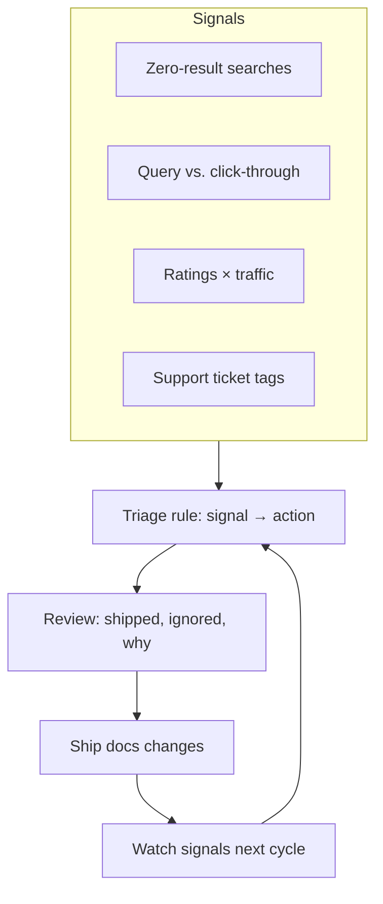

import Callout from '@site/src/components/Callout';
import Metric from '@site/src/components/Metric';

# Data-informed documentation

## Context

A documentation portal accumulates signals whether anyone reads them or not:
page feedback ratings, search queries, page views, support tickets, comment
threads, bounce rate, visit duration. Signals exist, but nobody reads them in a structured way, so "what should the docs fix next?" gets answered
by whoever complains most.

## Problem

Three symptoms of an un-instrumented docs backlog:

1. **Prioritization by anecdote.** A page got attention when a customer
   escalated, not when a thousand readers quietly bounced off it.
2. **Invisible content gaps.** Users searched the portal for terms the docs
   never mentioned. Zero-result searches are a written list of unmet need —
   and they were going unread.
3. **No way to show impact.** Without baseline numbers, docs work couldn't
   demonstrate that an improvement changed anything, which made it hard to
   argue for more of it.

## Approach

A lightweight, recurring analytics loop rather than a one-off dashboard
project. Small enough to sustain alongside writing work; structured enough
that decisions trace back to evidence.



**1. Signal inventory.** Consolidated four sources that already existed:

- **Zero-result search queries** (Algolia) — what users look for and don't
  find.
- **Top search queries vs. click-through** — what users look for, find, and
  still don't click.
- **Page feedback ratings crossed with page views** — a low-rated page with
  high traffic is a different problem than a low-rated page nobody reads.
- **Support ticket tags** — recurring question themes that docs should
  absorb.

**2. A triage rule, not a pile of reports.** Each signal maps to a specific
kind of docs action:

| Signal | Action |
|---|---|
| Zero-result query, high frequency | New content (or a synonym/redirect fix) |
| High traffic, low rating | Rewrite or restructure the page |
| High traffic, fine rating | Leave it alone — resist tinkering |
| Recurring support theme | Absorb into a how-to; link it from the error path |

**3. A fixed cadence.** A short review every month: what changed in the
signals, what we shipped against them, what we deliberately ignored and
why. The last column matters — it keeps the data a *tool for decisions*,
not a compliance exercise.

**4. Closing the loop.** When a page shipped in response to a signal, the
signal was watched for the next cycles to confirm the needle moved — and
rolled back or revisited when it didn't.

<Callout type="decision">
Deliberately no real-time dashboards. A fortnightly batch review with a
written triage rule beats a live dashboard nobody opens. The deliverable
was the *decision*, not the visualization.
</Callout>

## Result

<div className="metric-row">
  <Metric value="down" label="zero-result searches, cycle over cycle" />
  <Metric value="up" label="feedback score on reworked pages" />
  <Metric value="visible" label="docs impact to stakeholders" />
</div>

- The zero-result query backlog turned into a concrete content plan — the
  highest-frequency gaps became new pages and synonym fixes first.
- Rewriting the top *traffic-weighted* low-rated pages moved their feedback
  scores; the same effort spent on low-traffic pages would have been
  invisible.
- Docs work gained a defensible narrative: each cycle could point to the
  signal, the change, and the measured follow-up.

<Callout type="context">
Numbers here are directional by design — portal analytics measure behavior
on the docs surface, not product outcomes. The honest claim is *signal
moved*, not *revenue grew*.
</Callout>

## Artifacts

- The triage table above is the actual working artifact — one page, printed
  into a regular review.
- A zero-result query review, condensed:

```
query                        hits/mo   action
---------------------------  -------   -------------------------
"rest api authentication"      140     new page + synonym map
"export csv scheduled"          87     add to existing how-to
"sso scim provisioning"         61     new page (gap confirmed)
```

- Synonym and redirect configuration lives in version control alongside the
  docs, so search fixes are reviewable like any other content change.

## Lessons

- **Weight every signal by traffic.** A complaint about an obscure page and
  a complaint about the most-read page are not the same size of problem.
- **Zero-result searches are the cheapest content-gap research that exists.**
  Users are literally writing your backlog for you.
- **Vanity metrics are the main risk.** Page views going up is not a docs
  win if the task-completion signals don't move. Pick the two or three
  signals that correspond to reader success and let the rest be context.
- **Data informs; it doesn't decide.** Some of the best calls in the cycle
  were ignoring a noisy signal for a documented reason — the value is in
  making the *reason* explicit.

<Callout type="context">
The same loop could run on this site, at portfolio scale — the signal is
wired up via cookieless analytics; see
[How this site works](../meta/this-site.mdx).
</Callout>
